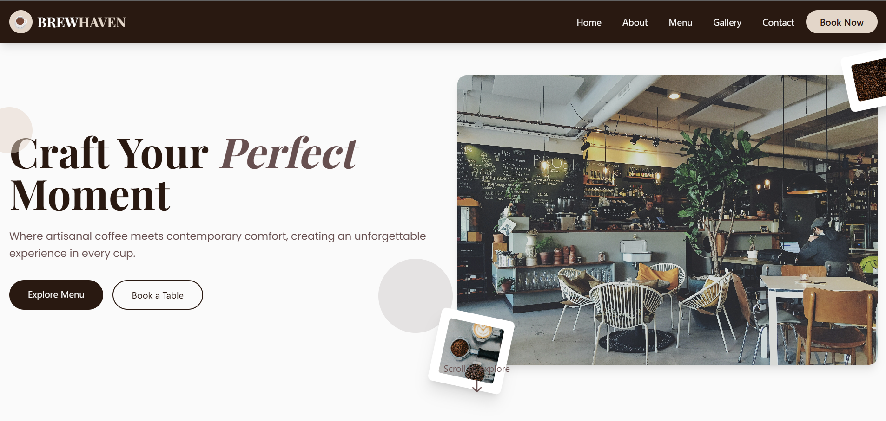

# BREWHAVEN Coffee Shop Website

A modern, responsive website for BREWHAVEN Coffee Shop built with HTML, Tailwind CSS, and JavaScript.

## 🚀 Features

- Responsive design that works on all devices
- Modern and clean UI/UX
- Interactive menu carousel
- Beautiful image gallery
- Online booking system
- Contact form with WhatsApp integration
- Location map integration
- Social media integration
- Performance optimized

## 🛠 Technologies Used

- HTML5
- Tailwind CSS
- JavaScript
- AOS (Animate On Scroll)
- Google Maps API

## 📋 Pages/Sections

1. **Home** - Welcoming hero section
2. **About** - Company history and values
3. **Menu** - Interactive menu carousel with filtering
4. **Gallery** - Image gallery with carousel
5. **Events/Promos** - Special offers and events
6. **Location** - Map and contact information
7. **Contact** - Contact form with social media links

## 🔧 Installation & Setup

1. Clone the repository 
2. Navigate to project directory
3. Open `index.html` in your browser or use a local server

## 💻 Development

To modify the website:

1. Tailwind CSS is loaded via CDN
2. JavaScript files are in `script.js`
3. Custom styles are in `style.css`
4. Images should be placed in the `image` folder

## 📱 Responsive Design

The website is fully responsive and optimized for:
- Mobile devices
- Tablets
- Desktops
- Large screens

## ⚡ Performance Optimization

- Lazy loading for images
- Minified CSS and JavaScript
- Optimized image formats
- Efficient animations
- Reduced server requests

## 📞 Contact Information

For business inquiries:
- WhatsApp: +62 895 3430 61397
- Email: raygavriel91@gmail.com

## 🙏 Acknowledgments

- Images from Unsplash
- Icons from Heroicons
- Fonts from Google Fonts

---
Made with ☕ by Raviel
